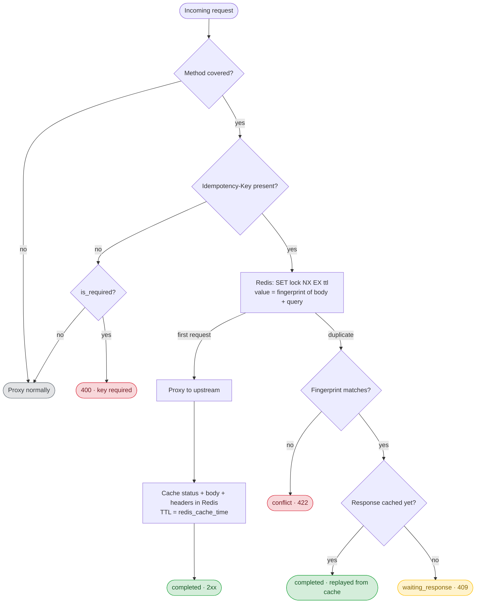

# Kong Plugin Idempotency

A Kong plugin that makes unsafe HTTP requests **idempotent** (safe to retry),
backed by Redis. `POST` is handled by default; `PUT`/`PATCH`/`DELETE` can be
enabled via `config.methods`.

## Description

Clients send an `X-Idempotency-Key` header with their request. For a given key,
the plugin guarantees the request is processed **at most once**: the first
request is proxied to the upstream and its response is cached in Redis; any later
request carrying the same key replays that cached response instead of hitting the
upstream again.

This makes it safe for clients to retry requests (network blips, timeouts,
double-clicks) without creating duplicate side effects.

The **client owns key uniqueness**: use a fresh value (e.g. a UUID) per distinct
operation, and reuse the same value when retrying that operation.

### How it works



> The labels in the green/amber/red boxes are the resulting
> `X-Idempotency-Status` header value and HTTP status code.

For each eligible request the plugin uses an atomic Redis `SET key <fp> NX EX <ttl>`
to claim a per-key lock (where `<fp>` is a fingerprint of the request):

1. **First request wins the lock** → it is proxied normally. In the `response`
   phase the upstream status, body and headers are stored in Redis under a
   separate response key with the configured TTL. The client gets the response
   with `X-Idempotency-Status: completed`.
2. **A duplicate arrives while the first is still in flight** (lock held, no
   cached response yet) → the client gets `409` with
   `X-Idempotency-Status: waiting_response`, signalling it to retry shortly.
3. **A duplicate arrives after the first finished** → the cached response is
   replayed verbatim with `X-Idempotency-Status: completed`.
4. **The same key is reused with a different request** (when
   `verify_fingerprint` is on) → the client gets `422` with
   `X-Idempotency-Status: conflict`; the request is neither processed nor
   replayed.

Keys are namespaced as
`[<redis-username>::]<redis_prefix>:<consumer>:<host>:<path>:<method>:{lock|resp}:<key>`
(where `<consumer>` is the authenticated consumer id, or `anonymous`). This scope
ensures the same client-supplied key cannot collide — and leak responses —
across different consumers, hosts or endpoints sharing one Redis instance. The
fingerprint (md5 of the request body + query string) detects key reuse with a
different request.

> **Resilience:** if Redis is unreachable the plugin *fails open* — the request
> is proxied normally (a warning is logged) rather than taking the protected
> service down. The idempotency guarantee is lost for the duration of the
> outage. Set `fail_open = false` to reject with `503` instead.

> **Ordering & buffering:** the plugin runs at priority `-1`, i.e. *after*
> authentication, so the authenticated consumer is available for per-consumer
> scoping — keep your auth plugin in front of it. Because it caches the whole
> upstream response, Kong buffers responses on the routes where it is enabled
> (a consideration for very large response bodies).

## Requirements

- **Kong** ≥ 3.6 — uses Kong's shared `config.redis.*` schema. Tested on
  3.6.1, 3.8.0 and 3.9.2.
- **Redis** reachable from Kong (Redis 6.0+ if you use the ACL `username` auth).

## Installation

```bash
$ luarocks install kong-plugin-idempotency
```

Update the `plugins` config to add `idempotency`:

```
plugins = bundled,idempotency
```

## Configuration

```bash
$ curl -X POST http://kong:8001/services/{service}/plugins \
    --data "name=idempotency" \
    --data "config.redis.host=my_redis_server" \
    --data "config.redis.port=6379" \
    --data "config.redis_cache_time=86400"
```

Send requests with the key:

```bash
$ curl -X POST http://kong:8000/orders \
    -H "X-Idempotency-Key: 7e3f…" \
    -d '{"amount": 100}'
```

| Parameter | default | description |
| ---       | ---     | ---         |
| `config.is_required` | `false` | When `false`, requests without an `X-Idempotency-Key` are passed through untouched. When `true`, such requests are rejected with `400`. |
| `config.methods` | `["POST"]` | HTTP methods the plugin applies idempotency to. Allowed: `POST`, `PUT`, `PATCH`, `DELETE`. |
| `config.verify_fingerprint` | `true` | Store a fingerprint (md5 of body + query) with the key and reject (`422`) when the same key is reused with a different request, instead of replaying the original response. |
| `config.cache_5xx` | `false` | When `false`, `5xx` responses are not cached and the lock is released, so the client can retry after a transient server error. |
| `config.fail_open` | `true` | When `true`, a Redis outage lets requests through (idempotency guarantee lost). When `false`, such requests are rejected with `503`. |
| `config.redis_cache_time` | `86400` | TTL of the idempotency lock and the cached response — i.e. the window during which a key is treated as a duplicate. Whole seconds (integer), must be > 0. |
| `config.redis_prefix` | `kong-idempotency-plugin` | Namespace prepended to every Redis key. |
| `config.redis.host` | | **Mandatory.** Redis host. |
| `config.redis.port` | `6379` | |
| `config.redis.password` | | Referenceable (vault). |
| `config.redis.username` | | Referenceable (vault). Requires Redis 6.0.0+. Also scopes the Redis keys. |
| `config.redis.ssl` | `false` | |
| `config.redis.ssl_verify` | `false` | |
| `config.redis.server_name` | | SNI used for the TLS handshake. |
| `config.redis.timeout` | `2000` | Socket timeout in ms. |
| `config.redis.database` | `0` | |

> The Redis config uses Kong's shared `config.redis.*` record (Kong 3.6+). The
> legacy flat fields (`config.redis_host`, `config.redis_port`,
> `config.redis_password`, …) are still accepted for backwards compatibility and
> are folded into `config.redis.*`.

### Response headers

| Header | values | meaning |
| --- | --- | --- |
| `X-Idempotency-Status` | `completed` | The response is the (cached or freshly produced) result for this key. |
| `X-Idempotency-Status` | `waiting_response` | The original request for this key is still in flight (returned with `409`). |
| `X-Idempotency-Status` | `conflict` | The key was reused with a different request (returned with `422`). |

### Example

```bash
# 1) first request — proxied to the upstream, response cached
$ curl -i -X POST http://kong:8000/orders -H 'X-Idempotency-Key: abc' -d '{"amount":100}'
HTTP/1.1 201 Created
X-Idempotency-Status: completed

# 2) same key, same request — replayed from cache (upstream is NOT called again)
$ curl -i -X POST http://kong:8000/orders -H 'X-Idempotency-Key: abc' -d '{"amount":100}'
HTTP/1.1 201 Created
X-Idempotency-Status: completed

# 3) same key, DIFFERENT request — rejected (verify_fingerprint)
$ curl -i -X POST http://kong:8000/orders -H 'X-Idempotency-Key: abc' -d '{"amount":999}'
HTTP/1.1 422 Unprocessable Entity
X-Idempotency-Status: conflict

# 4) same key while the first is still in flight — retry shortly
$ curl -i -X POST http://kong:8000/orders -H 'X-Idempotency-Key: abc' -d '{"amount":100}'
HTTP/1.1 409 Conflict
X-Idempotency-Status: waiting_response
```

## Development & Testing

The plugin is covered by two test suites under `spec/`:

- `spec/01-unit` — fast, fully-mocked unit tests for every module
  (`keys`, `cache`, `access`, `response`, `handler`). No Kong/network needed.
- `spec/02-integration` — end-to-end tests that boot a real Kong + Redis,
  validate the schema and exercise the full flow: first request, cache replay,
  in-flight `409`, fingerprint conflict `422`, required key, passthrough, other
  methods, strict-mode `503`, per-consumer scoping and the legacy config.

Tests run inside [Pongo](https://github.com/Kong/kong-pongo), Kong's official
test runner (requires Docker). The provided `Makefile` vendors Pongo locally on
first use:

```bash
make test                  # luacheck + the whole suite
make unit                  # only spec/01-unit
make integration           # only spec/02-integration (needs Redis, provided by Pongo)
make lint                  # luacheck only
make test KONG_VERSION=3.6.1   # pin a specific Kong version
```

CI runs the same suite across Kong 3.6.1 / 3.8.0 / 3.9.2 (see
`.github/workflows/test.yml`). A local [`playground`](./playground) (Docker
Compose) is also provided.

## Notes & possible improvements

- **Lock cleanup on failure.** If the original request acquires the lock but
  never caches a response (e.g. the upstream resets the connection mid-flight),
  the lock is released in the `log` phase (via a timer, since Redis is not
  reachable from `log` directly), so retries are not stuck on `409` for the whole
  window. One minor caveat remains: the lock and the cached response are set at
  slightly different times with independent TTLs, so a duplicate arriving in a
  narrow window (~the original's processing time, roughly one TTL later) could
  reprocess despite a cached response.
- **Error responses.** `5xx` responses are not cached by default (`cache_5xx`),
  so a transient server error does not become "sticky". `4xx` responses are
  cached (a deterministic client error replays safely).
- **Key scope.** A key is scoped to the authenticated consumer (or `anonymous`),
  request host, path and method (plus the static Redis username). Retries of the
  *same* operation by the *same* caller are idempotent; the same key on a
  different path is treated as a distinct request. Scoping is not yet
  configurable.

## Author

Udlei Nati - [GitHub](https://github.com/udleinati "GitHub") - [LinkedIn](https://www.linkedin.com/in/udleinati/ "LinkedIn")

## License

[MIT](./LICENSE)
